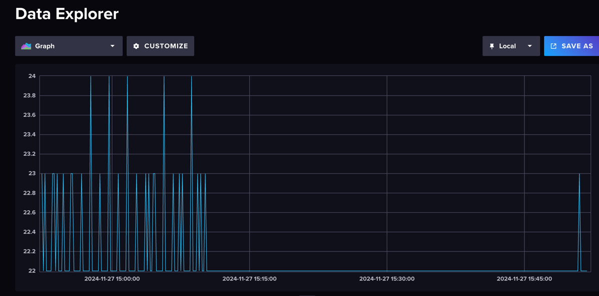
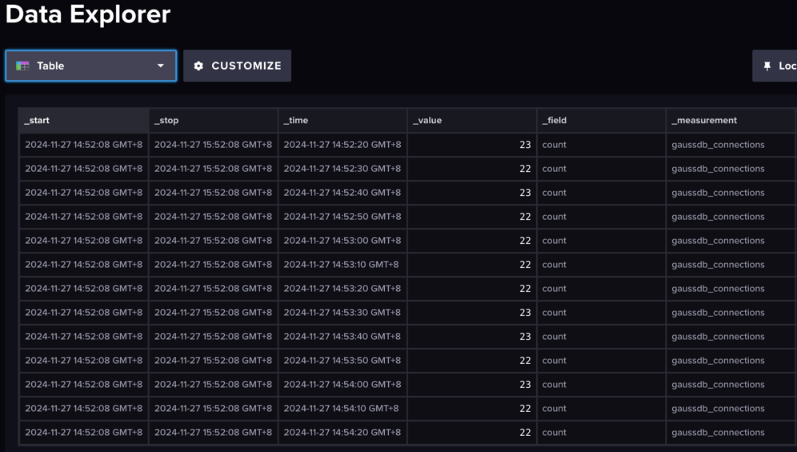

# telegraf-input-gaussdb
Telegraf external plugin that gathers GaussDB monitoring metrics.

## Usage

`git clone https://github.com/qixia1998/telegraf-input-gaussdb`

* Install [telegraf](https://www.influxdata.com/time-series-platform/telegraf/).

* Install InfluxDB.

* You can look at the plugin.conf.example and edit it. 

```toml
[[inputs.gauss]]
	host = "gaussdb_host"
	port = port
	user = "gaussdb_user"
	password = "gaussdb_password"
	dbname = "gaussdb_dbname"
```
* Build the plugin.

`go build -o gauss cmd/main.go`

* Edit the telegraf.conf .
```toml
[[inputs.execd]]
   command = ["./gauss", "-config", "/path/to/plugin.conf"]
   signal = "none"
   restart_delay = "10s"
   data_format = "influx"

[[outputs.influxdb_v2]]
  urls = ["http://localhost:8086"]
  token = "my-token"
  organization = "my-org"
  bucket = "my-bucket"

# sample output: write metrics to stdout
[[outputs.file]]
  files = ["stdout"]
```

* Restart or reload Telegraf.

`telegraf --config telegraf.conf`


## Resources
* [External plugin overview](https://github.com/influxdata/telegraf/blob/master/plugins/common/shim/README.md)
* [Examples of other external plugins](https://github.com/influxdata/telegraf/blob/master/EXTERNAL_PLUGINS.md)


If everything is ok, you should see something like this

```text
gaussdb_connections,host=xxxx.local count=22i 1732693849219899000
gaussdb_connections,host=xxxx.local count=23i 1732693859233575000
```

## Example

